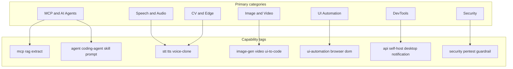

# Categories — Phân nhóm & hệ thống Tags

> **Primary** = 1 “nhà” cho mục lục (§1–§7).  
> **Tags** = nhiều nhãn capability.  
> Mục lục đầy đủ: [../README.md](../README.md) · Index star: [../repos/README.md](../repos/README.md)

---

## Quy tắc gán

1. Chọn **đúng một** Primary theo use case chính khi star.
2. Gắn **mọi** Tags khớp tính năng thật (MCP + RAG + CLI → cả ba).
3. Harness CLI-Anything: Primary theo **domain ngang**; luôn có `harness` (+ `cli`).
4. Công nghệ xuất hiện 2 chỗ mục lục (vd. drawio-skill): Primary = Agents; liệt kê lại dưới DevTools với cùng Tags.
5. Không tạo Primary mới chỉ vì 1 repo — thêm **tag** hoặc **subgroup** trước.
6. Client/API không chính thức (vd. CapCut): ghi rõ ToS trong bài viết.

---

## Sơ đồ 7 nhóm

**Phân bố ★:** Agents 24 · Speech 11 · Image/Video 10 · UI 4 · DevTools 13 · CV 1 · Security 1 · **= 64**

---

## 1. MCP & AI Agents

### 1.1 MCP connectors & extract

| Công nghệ | Tags | Bài viết |
|-----------|------|----------|
| NotebookLM MCP | `mcp` `rag` | [notebooklm-mcp.md](../technologies/notebooklm-mcp.md) |
| SAG | `rag` `mcp` `self-host` | [sag.md](../technologies/sag.md) |
| Hyper-Extract | `extract` `rag` `mcp` `cli` | [hyper-extract.md](../technologies/hyper-extract.md) |
| PageIndex | `rag` `mcp` `self-host` `cli` | [pageindex.md](../technologies/pageindex.md) |
| Pathway | `rag` `cli` `self-host` `workflow` `api` | [pathway.md](../technologies/pathway.md) |
| PixelRAG | `rag` `cli` `skill` `api` | [pixelrag.md](../technologies/pixelrag.md) |

### 1.2 RAG platforms

| Công nghệ | Tags | Bài viết |
|-----------|------|----------|
| WeKnora | `rag` `mcp` `agent` `self-host` `cli` `skill` | [weknora.md](../technologies/weknora.md) |
| RAGFlow | `rag` `agent` `mcp` `self-host` `api` | [ragflow.md](../technologies/ragflow.md) |
| AnythingLLM | `rag` `agent` `mcp` `self-host` `desktop` `api` | [anything-llm.md](../technologies/anything-llm.md) |
| Open Notebook | `rag` `self-host` `api` `tts` | [open-notebook.md](../technologies/open-notebook.md) |
| Khoj | `rag` `agent` `self-host` `desktop` `stt` | [khoj.md](../technologies/khoj.md) |
| SurfSense | `rag` `agent` `mcp` `self-host` `api` `workflow` | [surfsense.md](../technologies/surfsense.md) |
| Obsidian harness | `harness` `rag` `cli` | [obsidian.md](../technologies/cli-anything/obsidian.md) |

### 1.3 Agent runtime

| Công nghệ | Tags | Bài viết |
|-----------|------|----------|
| Hermes Agent | `agent` `mcp` `skill` `cli` `self-host` | [hermes-agent.md](../technologies/hermes-agent.md) |
| OpenHands | `coding-agent` `agent` `self-host` | [openhands.md](../technologies/openhands.md) |
| EpicStaff | `agent` `mcp` `rag` `self-host` `workflow` | [epicstaff.md](../technologies/epicstaff.md) |
| CLI-Anything ★ | `cli` `harness` `skill` `agent` | [cli-anything.md](../technologies/cli-anything.md) |

### 1.4 Skill · prompt · memory · knowledge graph · guardrail

| Công nghệ | Tags | Bài viết |
|-----------|------|----------|
| prompts.chat | `prompt` `mcp` `cli` `self-host` | [prompts-chat.md](../technologies/prompts-chat.md) |
| Ponytail | `skill` `coding-agent` `prompt` | [ponytail.md](../technologies/ponytail.md) |
| Addy's Agent Skills | `skill` `coding-agent` `prompt` | [agent-skills.md](../technologies/agent-skills.md) |
| Understand Anything | `skill` `coding-agent` `rag` `cli` `agent` | [understand-anything.md](../technologies/understand-anything.md) |
| Headroom | `mcp` `cli` `agent` `coding-agent` `self-host` | [headroom.md](../technologies/headroom.md) |
| TencentDB Agent Memory | `agent` `self-host` `coding-agent` | [tencentdb-agent-memory.md](../technologies/tencentdb-agent-memory.md) |
| drawio-skill | `skill` `diagram` `cli` | [drawio-skill.md](../technologies/drawio-skill.md) |
| Destructive Command Guard | `guardrail` `cli` | [destructive-command-guard.md](../technologies/destructive-command-guard.md) |

**Cây harness:** [cli-anything/README.md](../technologies/cli-anything/README.md)

---

## 2. Speech & Audio

### 2.1 STT engines

| Công nghệ | Tags | Bài viết |
|-----------|------|----------|
| faster-whisper | `stt` `cli` | [faster-whisper.md](../technologies/faster-whisper.md) |
| FunASR | `stt` `cli` `api` `self-host` `mcp` | [funasr.md](../technologies/funasr.md) |
| CapCut TTS/STT API | `stt` `tts` `cli` `api` | [capcut-tts-api.md](../technologies/capcut-tts-api.md) |
| VideoCaptioner harness | `harness` `stt` `video` | [videocaptioner.md](../technologies/cli-anything/videocaptioner.md) |

### 2.2 Voice studios

| Công nghệ | Tags | Bài viết |
|-----------|------|----------|
| Voicebox | `stt` `tts` `voice-clone` `desktop` `self-host` `mcp` `api` | [voicebox.md](../technologies/voicebox.md) |
| OmniVoice Studio | `stt` `tts` `voice-clone` `desktop` `self-host` | [omnivoice-studio.md](../technologies/omnivoice-studio.md) |

### 2.3 TTS · Voice clone

| Công nghệ | Tags | Bài viết |
|-----------|------|----------|
| VoxCPM | `tts` `voice-clone` | [voxcpm.md](../technologies/voxcpm.md) |
| VibeVoice | `tts` `voice-clone` `self-host` | [vibevoice.md](../technologies/vibevoice.md) |
| VieNeu-TTS | `tts` `voice-clone` `self-host` `api` `desktop` | [vieneu-tts.md](../technologies/vieneu-tts.md) |

### 2.4 Audiobook pipeline

| Công nghệ | Tags | Bài viết |
|-----------|------|----------|
| AudioBook KJ | `tts` `voice-clone` `desktop` `self-host` `video` | [audiobook-kj.md](../technologies/audiobook-kj.md) |

### 2.5 Watermark & Edge

| Công nghệ | Tags | Bài viết |
|-----------|------|----------|
| AudioSeal | `watermark` | [audioseal.md](../technologies/audioseal.md) |
| XiaoZhi ESP32 | `stt` `tts` `edge` `iot` `mcp` | [xiaozhi-esp32.md](../technologies/xiaozhi-esp32.md) |

> Ảnh: [blind_watermark](../technologies/blind-watermark.md) *(Primary Image & Video)*.

---

## 3. Image & Video

### 3.1 Generate · compose

| Công nghệ | Tags | Bài viết |
|-----------|------|----------|
| ComfyUI ★ | `image-gen` `video` `self-host` | [comfyui.md](../technologies/comfyui.md) |
| ComfyUI harness | `harness` `image-gen` `cli` | [comfyui.md](../technologies/cli-anything/comfyui.md) |
| HyperFrames | `video` `cli` `agent` | [hyperframes.md](../technologies/hyperframes.md) |
| OpenMontage | `video` `agent` `skill` `coding-agent` `workflow` `cli` `tts` | [openmontage.md](../technologies/openmontage.md) |
| AI-auto-generate-video | `video` `skill` `tts` `cli` `agent` | [ai-auto-generate-video.md](../technologies/ai-auto-generate-video.md) |

### 3.2 Localize · dub

| Công nghệ | Tags | Bài viết |
|-----------|------|----------|
| pyVideoTrans | `video` `stt` `tts` `voice-clone` `desktop` `self-host` `cli` | [pyvideotrans.md](../technologies/pyvideotrans.md) |

### 3.3 UI → code · Agentic HTML

| Công nghệ | Tags | Bài viết |
|-----------|------|----------|
| ScreenCoder | `ui-to-code` | [screencoder.md](../technologies/screencoder.md) |
| AI Website Cloner | `ui-to-code` `coding-agent` `skill` | [ai-website-cloner.md](../technologies/ai-website-cloner.md) |
| HTML Anything | `skill` `coding-agent` `agent` `video` `self-host` | [html-anything.md](../technologies/html-anything.md) |

### 3.4 CAD · 3D · Game (harness)

| Harness | Tags | Bài viết |
|---------|------|----------|
| FreeCAD | `harness` `cad` `cli` | [freecad.md](../technologies/cli-anything/freecad.md) |
| Blender | `harness` `3d` `cli` | [blender.md](../technologies/cli-anything/blender.md) |
| Godot | `harness` `game` `cli` | [godot.md](../technologies/cli-anything/godot.md) |

### 3.5 Watermark · playlists

| Công nghệ | Tags | Bài viết |
|-----------|------|----------|
| blind_watermark | `watermark` `cli` | [blind-watermark.md](../technologies/blind-watermark.md) |
| iptv-org/iptv | `video` | [iptv-org.md](../technologies/iptv-org.md) |

---

## 4. UI Automation & Computer Use

| Lớp | Công nghệ | Tags | Bài viết |
|-----|-----------|------|----------|
| CDP driver | Puppeteer | `browser` `ui-automation` `api` `mcp` | [puppeteer.md](../technologies/puppeteer.md) |
| Vision | Midscene.js | `ui-automation` `computer-use` `browser` `skill` | [midscene.md](../technologies/midscene.md) |
| NL ↔ code | Stagehand | `ui-automation` `browser` `agent` | [stagehand.md](../technologies/stagehand.md) |
| DOM agent | Page Agent | `ui-automation` `browser` `dom` `mcp` `agent` | [page-agent.md](../technologies/page-agent.md) |
| Game CLI | Slay the Spire II | `harness` `ui-automation` `game` `cli` | [slay-the-spire-ii.md](../technologies/cli-anything/slay-the-spire-ii.md) |

---

## 5. Computer Vision & Edge

| Công nghệ | Tags | Bài viết |
|-----------|------|----------|
| ALPR | `cv` `edge` `self-host` | [alpr.md](../technologies/alpr.md) |

---

## 6. DevTools & Integration

### 6.1 Productivity · notify · collab

| Công nghệ | Tags | Bài viết |
|-----------|------|----------|
| Google Workspace CLI | `cli` `workspace` `skill` `office` | [google-workspace-cli.md](../technologies/google-workspace-cli.md) |
| ntfy | `notification` `self-host` `cli` | [ntfy.md](../technologies/ntfy.md) |
| TREK | `mcp` `self-host` `notification` `gis` | [trek.md](../technologies/trek.md) |
| Yuvomi | `self-host` `mcp` `api` `notification` | [yuvomi.md](../technologies/yuvomi.md) |
| Jitsi Meet | `self-host` `video` `api` | [jitsi-meet.md](../technologies/jitsi-meet.md) |
| Folo | `desktop` `self-host` | [folo.md](../technologies/folo.md) |

### 6.2 Documents · PDF · file type

| Công nghệ | Tags | Bài viết |
|-----------|------|----------|
| Magika | `cli` `security` | [magika.md](../technologies/magika.md) |
| Stirling-PDF | `pdf` `ocr` `self-host` `api` | [stirling-pdf.md](../technologies/stirling-pdf.md) |
| LibreOffice harness | `harness` `office` `cli` | [libreoffice.md](../technologies/cli-anything/libreoffice.md) |

### 6.3 Diagram · Workflow · GIS

| Công nghệ | Tags | Bài viết |
|-----------|------|----------|
| drawio-skill *(Primary: Agents)* | `skill` `diagram` `cli` | [drawio-skill.md](../technologies/drawio-skill.md) |
| Draw.io / n8n / ArcGIS harnesses | `harness` … | [cli-anything/](../technologies/cli-anything/README.md) |
| Vietnamese Provinces DB | `gis` | [vietnamese-provinces-database.md](../technologies/vietnamese-provinces-database.md) |

### 6.4 LLM gateway · train · inference

| Công nghệ | Tags | Bài viết |
|-----------|------|----------|
| FreeLLMAPI | `api` `self-host` `mcp` `desktop` | [freellmapi.md](../technologies/freellmapi.md) |
| LocalAI | `api` `self-host` `mcp` `agent` `stt` `tts` `image-gen` | [localai.md](../technologies/localai.md) |
| Unsloth | `self-host` `cli` `api` `desktop` | [unsloth.md](../technologies/unsloth.md) |
| DFlash | `cli` `self-host` `api` | [dflash.md](../technologies/dflash.md) |

> [ai-training](../../ai-training/README.md)

---

## 7. Security & Pentesting

| Công nghệ | Tags | Bài viết |
|-----------|------|----------|
| Strix | `security` `pentest` `agent` `cli` | [strix.md](../technologies/strix.md) |

**Khác guardrail:** dcg = phòng agent · Strix = pentest có RoE · Magika = file-type trước ingest.

---

## Tags chuẩn hóa

Slug **lowercase**, kebab (`ui-to-code`, `coding-agent`).  
Chú giải + điểm neo: [README Tag index](../README.md#tag-index--capability--gợi-ý).
