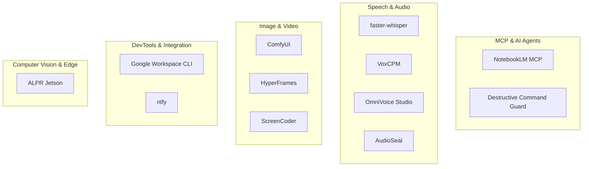

# Categories — Phân nhóm công nghệ AI

## Sơ đồ phân loại

---

## 1. MCP & AI Agents

**Mục đích:** Kết nối AI agent với nguồn tri thức, bảo vệ môi trường khi agent chạy lệnh.

| Công nghệ | Vai trò | Bài viết |
|-----------|---------|----------|
| NotebookLM MCP | RAG qua NotebookLM + Gemini, citation-backed | [notebooklm-mcp.md](../technologies/notebooklm-mcp.md) |
| Destructive Command Guard | Chặn lệnh git/shell nguy hiểm từ agent | [destructive-command-guard.md](../technologies/destructive-command-guard.md) |

**Liên quan ai_core:** `xb_mcp`, `ai_agentic`, `ai_rag_core`

---

## 2. Speech & Audio

**Mục đích:** STT, TTS, voice cloning, watermark âm thanh AI.

| Công nghệ | Vai trò | Bài viết |
|-----------|---------|----------|
| faster-whisper | Speech-to-text nhanh (CTranslate2) | [faster-whisper.md](../technologies/faster-whisper.md) |
| VoxCPM | TTS đa ngôn ngữ, voice design, cloning | [voxcpm.md](../technologies/voxcpm.md) |
| OmniVoice Studio | Desktop app voice cloning local (thay ElevenLabs) | [omnivoice-studio.md](../technologies/omnivoice-studio.md) |
| AudioSeal | Watermark âm thanh AI-generated | [audioseal.md](../technologies/audioseal.md) |

**Use case Odoo:** Voice note → STT → agent; TTS cho notification; đánh dấu audio AI.

---

## 3. Image & Video Generation

**Mục đích:** Sinh ảnh/video, screenshot → code, HTML → video.

| Công nghệ | Vai trò | Bài viết |
|-----------|---------|----------|
| ComfyUI | Diffusion GUI modular (node graph) | [comfyui.md](../technologies/comfyui.md) |
| HyperFrames | HTML → video, built for agents | [hyperframes.md](../technologies/hyperframes.md) |
| ScreenCoder | Screenshot UI → HTML/CSS | [screencoder.md](../technologies/screencoder.md) |

**Use case Odoo:** Marketing assets, demo video, UI mockup từ design.

---

## 4. DevTools & Integration

**Mục đích:** CLI tích hợp workspace, push notification cho pipeline/agent.

| Công nghệ | Vai trò | Bài viết |
|-----------|---------|----------|
| Google Workspace CLI | Drive, Gmail, Calendar, Sheets… một CLI | [google-workspace-cli.md](../technologies/google-workspace-cli.md) |
| ntfy | Push notification HTTP → phone/desktop | [ntfy.md](../technologies/ntfy.md) |

**Use case Odoo:** Agent gửi alert qua ntfy; sync tài liệu Google Drive vào RAG.

---

## 5. Computer Vision & Edge

**Mục đích:** Inference CV real-time trên edge device (Jetson), offline, camera + GPS.

| Công nghệ | Vai trò | Bài viết |
|-----------|---------|----------|
| ALPR | Nhận dạng biển số portable trên Jetson Orin Nano | [alpr.md](../technologies/alpr.md) |

**Use case Odoo:** Fleet check-in, gate parking, webhook biển số → `fleet` + `ntfy`.
