# Categories — Phân nhóm công nghệ AI

## Sơ đồ phân loại

```mermaid
flowchart TB
    subgraph mcp [MCP & AI Agents]
        NLM[NotebookLM MCP]
        DCG[Destructive Command Guard]
        SAG[SAG Graph RAG]
        CLI[CLI-Anything]
        OB[Obsidian harness]
        CLI --> OB
    end
    subgraph speech [Speech & Audio]
        FW[faster-whisper]
        VOX[VoxCPM]
        OVS[OmniVoice Studio]
        AS[AudioSeal]
        XZ[XiaoZhi ESP32]
        VC[VideoCaptioner harness]
        CLI --> VC
    end
    subgraph media [Image & Video]
        COMFY[ComfyUI ★]
        HF[HyperFrames]
        SC[ScreenCoder]
        BL[Blender harness]
        FC[FreeCAD harness]
        GD[Godot harness]
        CUH[ComfyUI harness]
        CLI --> BL
        CLI --> FC
        CLI --> GD
        CLI --> CUH
        CUH -.-> COMFY
    end
    subgraph uiauto [UI Automation & Computer Use]
        MID[Midscene.js]
        STS[Slay the Spire II harness]
        CLI --> STS
    end
    subgraph dev [DevTools & Integration]
        GWS[Google Workspace CLI]
        NTFY[ntfy]
        DI[Draw.io harness]
        N8[n8n harness]
        LO[LibreOffice harness]
        AG[ArcGIS Pro harness]
        CLI --> DI
        CLI --> N8
        CLI --> LO
        CLI --> AG
    end
    subgraph cv [Computer Vision & Edge]
        ALPR[ALPR Jetson]
    end
```

> Harness CLI-Anything = **con** của CLI-Anything; **Domain** = nhóm ngang (Speech / Image / DevTools / UI Automation…).

---

## 1. MCP & AI Agents

**Mục đích:** Kết nối AI agent với nguồn tri thức, RAG self-host / MCP, bảo vệ môi trường khi agent chạy lệnh, và biến phần mềm thành CLI agent-native.

| Công nghệ | Vai trò | Bài viết |
|-----------|---------|----------|
| NotebookLM MCP | RAG qua NotebookLM + Gemini, citation-backed | [notebooklm-mcp.md](../technologies/notebooklm-mcp.md) |
| Destructive Command Guard | Chặn lệnh git/shell nguy hiểm từ agent | [destructive-command-guard.md](../technologies/destructive-command-guard.md) |
| SAG | Graph retrieval (event/entity) + workbench + MCP per project | [sag.md](../technologies/sag.md) |
| **CLI-Anything** ★ | Cha — sinh / cài CLI harness, CLI-Hub | [cli-anything.md](../technologies/cli-anything.md) |
| └ Obsidian harness | Knowledge vault agent-native (Local REST) | [cli-anything/obsidian.md](../technologies/cli-anything/obsidian.md) |

**Cây harness đầy đủ:** [cli-anything/README.md](../technologies/cli-anything/README.md)

**Liên quan ai_core:** `xb_mcp`, `ai_agentic`, `ai_rag_core`

---

## 2. Speech & Audio

**Mục đích:** STT, TTS, voice cloning, watermark âm thanh AI; voice agent trên edge (ESP32).

| Công nghệ | Vai trò | Bài viết |
|-----------|---------|----------|
| faster-whisper | Speech-to-text nhanh (CTranslate2) | [faster-whisper.md](../technologies/faster-whisper.md) |
| VoxCPM | TTS đa ngôn ngữ, voice design, cloning | [voxcpm.md](../technologies/voxcpm.md) |
| OmniVoice Studio | Desktop app voice cloning local (thay ElevenLabs) | [omnivoice-studio.md](../technologies/omnivoice-studio.md) |
| AudioSeal | Watermark âm thanh AI-generated | [audioseal.md](../technologies/audioseal.md) |
| XiaoZhi ESP32 | Firmware ESP32 voice chatbot (Lily Box / 小智) | [xiaozhi-esp32.md](../technologies/xiaozhi-esp32.md) |
| VideoCaptioner harness *(con CLI-Anything)* | Phụ đề video qua CLI agent | [cli-anything/videocaptioner.md](../technologies/cli-anything/videocaptioner.md) |

**Use case Odoo:** Voice note → STT → agent; TTS cho notification; đánh dấu audio AI; thiết bị voice edge.

---

## 3. Image & Video Generation

**Mục đích:** Sinh ảnh/video, screenshot → code, HTML → video; CAD/3D agent-native via harness.

| Công nghệ | Vai trò | Bài viết |
|-----------|---------|----------|
| ComfyUI ★ | Diffusion GUI modular (node graph) | [comfyui.md](../technologies/comfyui.md) |
| └ ComfyUI harness *(con CLI-Anything)* | CLI/skill điều khiển ComfyUI | [cli-anything/comfyui.md](../technologies/cli-anything/comfyui.md) |
| HyperFrames | HTML → video, built for agents | [hyperframes.md](../technologies/hyperframes.md) |
| ScreenCoder | Screenshot UI → HTML/CSS | [screencoder.md](../technologies/screencoder.md) |
| FreeCAD harness *(con CLI-Anything)* | CAD / 3D CLI + preview loop | [cli-anything/freecad.md](../technologies/cli-anything/freecad.md) |
| Blender harness *(con CLI-Anything)* | Scene 3D / render agent-native | [cli-anything/blender.md](../technologies/cli-anything/blender.md) |
| Godot harness *(con CLI-Anything)* | Game engine CLI / E2E | [cli-anything/godot.md](../technologies/cli-anything/godot.md) |

**Use case Odoo:** Marketing assets, demo video, UI mockup từ design.

---

## 4. UI Automation & Computer Use

**Mục đích:** Điều khiển UI bằng vision + ngôn ngữ tự nhiên (browser-use / phone-use / computer-use) — test E2E và agent thao tác màn hình, không phụ thuộc selector DOM.

| Công nghệ | Vai trò | Bài viết |
|-----------|---------|----------|
| Midscene.js | Vision UI automation/testing — web, Android, iOS, desktop | [midscene.md](../technologies/midscene.md) |
| Slay the Spire II harness *(con CLI-Anything)* | Game automation qua CLI (đối cực vision) | [cli-anything/slay-the-spire-ii.md](../technologies/cli-anything/slay-the-spire-ii.md) |

**Khác Image & Video:** ScreenCoder chuyển screenshot → **code**; Midscene dùng screenshot → **hành động / assert**.  
**Khác MCP & Agents:** không phải MCP server hay guardrail — là runtime automation/testing (có thể gắn Skills cho agent).  
**Khác CLI-Anything:** Midscene = click UI bằng vision; CLI-Anything (và con game harness) = expose app qua CLI có cấu trúc.

**Use case Odoo:** Smoke-test form/view khi xpath thay đổi; agent browser thao tác backend; visual assert layout.

---

## 5. DevTools & Integration

**Mục đích:** CLI tích hợp workspace, push notification, workflow/office/GIS/diagram cho pipeline/agent.

| Công nghệ | Vai trò | Bài viết |
|-----------|---------|----------|
| Google Workspace CLI | Drive, Gmail, Calendar, Sheets… một CLI | [google-workspace-cli.md](../technologies/google-workspace-cli.md) |
| ntfy | Push notification HTTP → phone/desktop | [ntfy.md](../technologies/ntfy.md) |
| Draw.io harness *(con CLI-Anything)* | Diagram agent-native | [cli-anything/drawio.md](../technologies/cli-anything/drawio.md) |
| n8n harness *(con CLI-Anything)* | Workflow automation CLI | [cli-anything/n8n.md](../technologies/cli-anything/n8n.md) |
| LibreOffice harness *(con CLI-Anything)* | Convert / office headless | [cli-anything/libreoffice.md](../technologies/cli-anything/libreoffice.md) |
| ArcGIS Pro harness *(con CLI-Anything)* | GIS + MCP bridge | [cli-anything/arcgis-pro.md](../technologies/cli-anything/arcgis-pro.md) |

**Use case Odoo:** Agent gửi alert qua ntfy; sync tài liệu Google Drive vào RAG; preprocess LibreOffice → RAG.

---

## 6. Computer Vision & Edge

**Mục đích:** Inference CV real-time trên edge device (Jetson), offline, camera + GPS.

| Công nghệ | Vai trò | Bài viết |
|-----------|---------|----------|
| ALPR | Nhận dạng biển số portable trên Jetson Orin Nano | [alpr.md](../technologies/alpr.md) |

**Use case Odoo:** Fleet check-in, gate parking, webhook biển số → `fleet` + `ntfy`.
