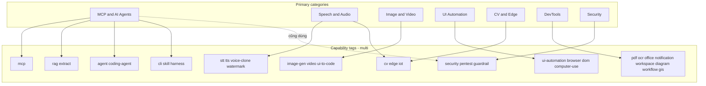

# Categories — Phân nhóm & hệ thống Tags

> **Primary category** = 1 “nhà” cho mục lục.  
> **Tags** = nhiều nhãn capability — bắt buộc nếu repo đa năng.  
> Chi tiết mục lục: [../README.md](../README.md)

---

## Quy tắc gán

1. Chọn **đúng một** Primary theo use case chính khi bạn star.
2. Gắn **mọi** Tags khớp tính năng thật (MCP + RAG + CLI → cả ba).
3. Harness CLI-Anything: Primary theo **domain ngang**; luôn có tag `harness` (+ `cli`).
4. Công nghệ xuất hiện ở 2 chỗ mục lục (vd. drawio-skill): Primary = Agents; vẫn liệt kê lại dưới DevTools · Diagram với cùng Tags.
5. Không tạo Primary mới chỉ vì 1 repo — thêm **tag** hoặc **subgroup** trước.

---

## Sơ đồ 7 nhóm + multi-tag hub

---

## 1. MCP & AI Agents

**Mục đích:** Kết nối agent với tri thức, MCP, runtime, skill/prompt, CLI agent-native, guardrail.

### 1.1 MCP & RAG / Knowledge

| Công nghệ | Tags | Bài viết |
|-----------|------|----------|
| NotebookLM MCP | `mcp` `rag` | [notebooklm-mcp.md](../technologies/notebooklm-mcp.md) |
| SAG | `rag` `mcp` `self-host` | [sag.md](../technologies/sag.md) |
| Hyper-Extract | `extract` `rag` `mcp` `cli` | [hyper-extract.md](../technologies/hyper-extract.md) |
| PageIndex | `rag` `mcp` `self-host` `cli` | [pageindex.md](../technologies/pageindex.md) |
| Obsidian harness | `harness` `rag` `cli` | [obsidian.md](../technologies/cli-anything/obsidian.md) |

### 1.2 Agent runtime & coding agents

| Công nghệ | Tags | Bài viết |
|-----------|------|----------|
| Hermes Agent | `agent` `mcp` `skill` `cli` `self-host` | [hermes-agent.md](../technologies/hermes-agent.md) |
| OpenHands | `coding-agent` `agent` `self-host` | [openhands.md](../technologies/openhands.md) |
| CLI-Anything ★ | `cli` `harness` `skill` `agent` | [cli-anything.md](../technologies/cli-anything.md) |

### 1.3 Prompt · Skill · Guardrail

| Công nghệ | Tags | Bài viết |
|-----------|------|----------|
| prompts.chat | `prompt` `mcp` `cli` `self-host` | [prompts-chat.md](../technologies/prompts-chat.md) |
| Ponytail | `skill` `coding-agent` `prompt` | [ponytail.md](../technologies/ponytail.md) |
| drawio-skill | `skill` `diagram` `cli` | [drawio-skill.md](../technologies/drawio-skill.md) |
| Destructive Command Guard | `guardrail` `cli` | [destructive-command-guard.md](../technologies/destructive-command-guard.md) |

**Cây harness:** [cli-anything/README.md](../technologies/cli-anything/README.md)  
**Liên quan ai_core:** `xb_mcp`, `ai_agentic`, `ai_rag_core`

---

## 2. Speech & Audio

### 2.1 STT

| Công nghệ | Tags | Bài viết |
|-----------|------|----------|
| faster-whisper | `stt` `cli` | [faster-whisper.md](../technologies/faster-whisper.md) |
| OmniVoice Studio | `stt` `tts` `voice-clone` `desktop` `self-host` | [omnivoice-studio.md](../technologies/omnivoice-studio.md) |
| VideoCaptioner harness | `harness` `stt` `video` | [videocaptioner.md](../technologies/cli-anything/videocaptioner.md) |

### 2.2 TTS · Voice clone

| Công nghệ | Tags | Bài viết |
|-----------|------|----------|
| VoxCPM | `tts` `voice-clone` | [voxcpm.md](../technologies/voxcpm.md) |
| OmniVoice Studio | *(đa tag — xem 2.1)* | |

### 2.3 Watermark & Edge

| Công nghệ | Tags | Bài viết |
|-----------|------|----------|
| AudioSeal | `watermark` | [audioseal.md](../technologies/audioseal.md) |
| XiaoZhi ESP32 | `stt` `tts` `edge` `iot` `mcp` | [xiaozhi-esp32.md](../technologies/xiaozhi-esp32.md) |

> Ảnh: [blind_watermark](../technologies/blind-watermark.md) *(Primary Image & Video §3.4)*.

**Use case Odoo:** voice note → STT → agent; TTS notify; watermark audio AI; thiết bị edge.

---

## 3. Image & Video Generation

### 3.1 Diffusion · Video

| Công nghệ | Tags | Bài viết |
|-----------|------|----------|
| ComfyUI ★ | `image-gen` `video` `self-host` | [comfyui.md](../technologies/comfyui.md) |
| ComfyUI harness | `harness` `image-gen` `cli` | [comfyui.md](../technologies/cli-anything/comfyui.md) |
| HyperFrames | `video` `cli` `agent` | [hyperframes.md](../technologies/hyperframes.md) |
| AI-auto-generate-video | `video` `skill` `tts` `cli` `agent` | [ai-auto-generate-video.md](../technologies/ai-auto-generate-video.md) |

### 3.2 UI → code

| Công nghệ | Tags | Bài viết |
|-----------|------|----------|
| ScreenCoder | `ui-to-code` | [screencoder.md](../technologies/screencoder.md) |
| AI Website Cloner | `ui-to-code` `coding-agent` `skill` | [ai-website-cloner.md](../technologies/ai-website-cloner.md) |

### 3.3 CAD · 3D · Game (harness)

| Harness | Tags | Bài viết |
|---------|------|----------|
| FreeCAD | `harness` `cad` `cli` | [freecad.md](../technologies/cli-anything/freecad.md) |
| Blender | `harness` `3d` `cli` | [blender.md](../technologies/cli-anything/blender.md) |
| Godot | `harness` `game` `cli` | [godot.md](../technologies/cli-anything/godot.md) |

### 3.4 Image watermark

| Công nghệ | Tags | Bài viết |
|-----------|------|----------|
| blind_watermark | `watermark` `cli` | [blind-watermark.md](../technologies/blind-watermark.md) |

---

## 4. UI Automation & Computer Use

### 4.1 Vision / computer-use

| Công nghệ | Tags | Bài viết |
|-----------|------|----------|
| Midscene.js | `ui-automation` `computer-use` `browser` `skill` | [midscene.md](../technologies/midscene.md) |

### 4.2 DOM in-page

| Công nghệ | Tags | Bài viết |
|-----------|------|----------|
| Page Agent | `ui-automation` `browser` `dom` `mcp` `agent` | [page-agent.md](../technologies/page-agent.md) |

### 4.3 Game CLI harness

| Harness | Tags | Bài viết |
|---------|------|----------|
| Slay the Spire II | `harness` `ui-automation` `game` `cli` | [slay-the-spire-ii.md](../technologies/cli-anything/slay-the-spire-ii.md) |

**Ranh giới:** ScreenCoder = screenshot → **code**; Midscene = screenshot → **action**; Page Agent = DOM → action; CLI harness = surface có cấu trúc.

---

## 5. Computer Vision & Edge

| Công nghệ | Tags | Bài viết |
|-----------|------|----------|
| ALPR | `cv` `edge` `self-host` | [alpr.md](../technologies/alpr.md) |

**Use case:** fleet / parking → webhook + `ntfy`.

---

## 6. DevTools & Integration

### 6.1 Productivity & notify

| Công nghệ | Tags | Bài viết |
|-----------|------|----------|
| Google Workspace CLI | `cli` `workspace` `skill` `office` | [google-workspace-cli.md](../technologies/google-workspace-cli.md) |
| ntfy | `notification` `self-host` `cli` | [ntfy.md](../technologies/ntfy.md) |

### 6.2 PDF · Office

| Công nghệ | Tags | Bài viết |
|-----------|------|----------|
| Stirling-PDF | `pdf` `ocr` `self-host` `api` | [stirling-pdf.md](../technologies/stirling-pdf.md) |
| LibreOffice harness | `harness` `office` `cli` | [libreoffice.md](../technologies/cli-anything/libreoffice.md) |

### 6.3 Diagram · Workflow · GIS

| Công nghệ | Tags | Bài viết |
|-----------|------|----------|
| drawio-skill *(Primary: Agents)* | `skill` `diagram` `cli` | [drawio-skill.md](../technologies/drawio-skill.md) |
| Draw.io harness | `harness` `diagram` `cli` | [drawio.md](../technologies/cli-anything/drawio.md) |
| n8n harness | `harness` `workflow` `cli` | [n8n.md](../technologies/cli-anything/n8n.md) |
| ArcGIS Pro harness | `harness` `gis` `mcp` `cli` | [arcgis-pro.md](../technologies/cli-anything/arcgis-pro.md) |

---

## 7. Security & Pentesting

| Công nghệ | Tags | Bài viết |
|-----------|------|----------|
| Strix | `security` `pentest` `agent` `cli` | [strix.md](../technologies/strix.md) |

**Khác guardrail:** dcg = phòng agent; Strix = pentest đích được phép (RoE).

---

## Bảng Tags đầy đủ (chuẩn hóa)

Xem [chú giải + tag index trong README](../README.md#-chú-giải-tags). Giữ slug **lowercase**, `kebab` ngắn (`ui-to-code`, `coding-agent`).
