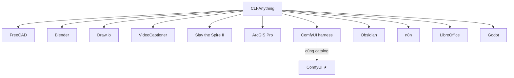

# CLI-Anything — Harness con (ecosystem)

> **Cha:** [CLI-Anything](../cli-anything.md) (`HKUDS/CLI-Anything`)  
> Các bài dưới đây **không phải** star riêng — là **agent-native CLI harness** trong monorepo / CLI-Hub.  
> Tags: luôn có `harness` (+ `cli`); domain tags theo capability ngang.

## Sơ đồ cha → con

## Index theo domain + tags

| Harness | Domain | Tags | Bài viết |
|---------|--------|------|----------|
| FreeCAD | Image & Video · CAD/3D | `harness` `cad` `cli` | [freecad.md](freecad.md) |
| Blender | Image & Video · 3D | `harness` `3d` `cli` | [blender.md](blender.md) |
| Draw.io | DevTools · Diagram | `harness` `diagram` `cli` | [drawio.md](drawio.md) |
| VideoCaptioner | Speech · Video | `harness` `stt` `video` | [videocaptioner.md](videocaptioner.md) |
| Slay the Spire II | UI Automation · Game | `harness` `ui-automation` `game` `cli` | [slay-the-spire-ii.md](slay-the-spire-ii.md) |
| ArcGIS Pro | DevTools · GIS | `harness` `gis` `mcp` `cli` | [arcgis-pro.md](arcgis-pro.md) |
| ComfyUI (harness) | Image & Video | `harness` `image-gen` `cli` | [comfyui.md](comfyui.md) |
| Obsidian | MCP & Agents · Knowledge | `harness` `rag` `cli` | [obsidian.md](obsidian.md) |
| n8n | DevTools · Workflow | `harness` `workflow` `cli` | [n8n.md](n8n.md) |
| LibreOffice | DevTools · Office | `harness` `office` `cli` | [libreoffice.md](libreoffice.md) |
| Godot | Image & Video · Game | `harness` `game` `cli` | [godot.md](godot.md) |

**Quy ước:** mỗi file con ghi `Parent: CLI-Anything` + `Domain` + `Tags`. ComfyUI ★ có bài riêng — harness là lớp agent CLI, link hai chiều.
