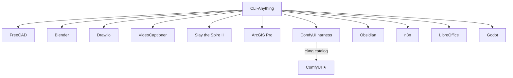

# CLI-Anything — Harness con (ecosystem)

> **Cha:** [CLI-Anything](../cli-anything.md) (`HKUDS/CLI-Anything`)  
> Các bài dưới đây **không phải** star riêng — là **agent-native CLI harness** trong monorepo / CLI-Hub.

## Sơ đồ cha → con

## Index theo domain (category)

| Harness | Domain category | Bài viết | Path trong repo |
|---------|-----------------|----------|-----------------|
| FreeCAD | Image & Video · CAD/3D | [freecad.md](freecad.md) | `freecad/agent-harness` |
| Blender | Image & Video · 3D | [blender.md](blender.md) | `blender` / demos |
| Draw.io | DevTools & Integration | [drawio.md](drawio.md) | `drawio/agent-harness` |
| VideoCaptioner | Speech & Audio · Video | [videocaptioner.md](videocaptioner.md) | `videocaptioner/agent-harness` |
| Slay the Spire II | UI Automation & Computer Use | [slay-the-spire-ii.md](slay-the-spire-ii.md) | `slay_the_spire_ii` |
| ArcGIS Pro | DevTools · GIS + MCP | [arcgis-pro.md](arcgis-pro.md) | registry / MCP bridge |
| ComfyUI (harness) | Image & Video | [comfyui.md](comfyui.md) | `comfyui/agent-harness` |
| Obsidian | MCP & AI Agents · Knowledge | [obsidian.md](obsidian.md) | `obsidian/agent-harness` |
| n8n | DevTools · Workflow | [n8n.md](n8n.md) | `n8n/agent-harness` |
| LibreOffice | DevTools · Office | [libreoffice.md](libreoffice.md) | `libreoffice/agent-harness` |
| Godot | Image & Video · Game | [godot.md](godot.md) | `godot/agent-harness` |

**Quy ước:** mỗi file con ghi `Parent: CLI-Anything` + `Domain: …`. ComfyUI đã có bài ★ riêng — harness chỉ là lớp agent CLI, link hai chiều.
